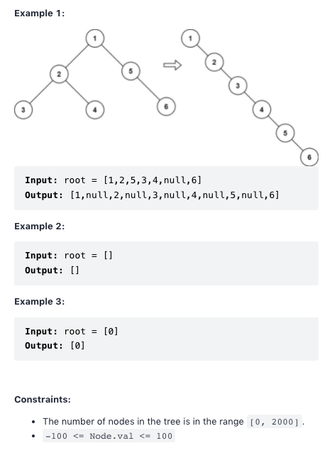
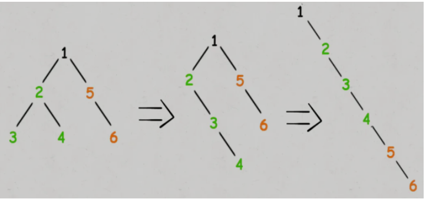

# Flatten Binary Tree to Linked List

## Questionn

Given the root of a binary tree, flatten the tree into a "linked list":
The "linked list" should use the same TreeNode class where the right child pointer points to the next node in the list and the left child pointer is always null.
The "linked list" should be in the same order as a pre-order traversal of the binary tree.


## Idea

### Post Traverse

```js
traverse(node.left);
traverse(node.right);
// TODO: do reorder
```

### Cache left and right sub trees

```js
const { left } = node;
const { right } = node;
```

### re-order the tree

```js
node.left = null;
node.right = left;
while (node.right !== null) {
  node = node.right;
}
node.right = right;
```



## Solution

```ts
const flatten = (root: TreeNode | null) => {
  if (!root) return;
  flatten(root.left);
  flatten(root.right);

  const left = root.left;
  const right = root.right;

  root.left = null;
  root.right = left;
  while (root.right !== null) {
    root = root.right;
  }
  root.right = right;
};
```

```java
public void flattern (TreeNode root) {
  if(root == null) {
    return;
  }
  flattern(root.left);
  flattern(root.right);

  TreeNode left = root.left;
  TreeNode right = root.right;

  root.left = null;
  root.right = left;

  while(root.right != null) {
    root = root.right;
  }
  root.right = right;
}
```
