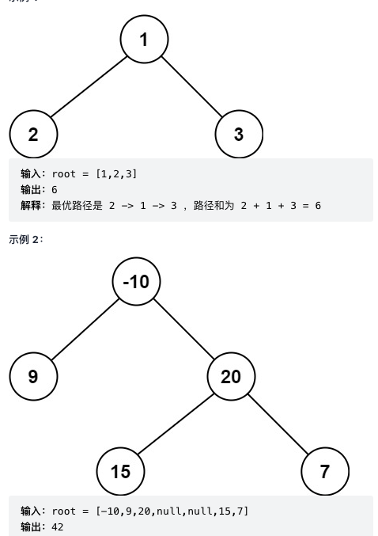

# LeetCode 124 sum of max path

- 路径被定义为一条从树中任意节点出发，沿父节点-子节点连接，达到任意节点的序列。
  同一个节点在一条路径序列中至多出现一次。该路径至少包含一个节点，且不一定经过根节点。
  路径和是路径中各节点值的总和。给你一个二叉树的根节点 root，返回其 最大路径和。
  
- solution
  1. (
     MaxPath(Subtree) =
     maxPath(root(SubTree).left)
     - maxPath(root(SubTree).right)
     - root(SubTree).val
       )
  2. MaxPath(tree) = max(maxLeftPathSum, rightPathSum) + root.val

```ts
/**
 * Definition for a binary tree node.
 * class TreeNode {
 *     val: number
 *     left: TreeNode | null
 *     right: TreeNode | null
 *     constructor(val?: number, left?: TreeNode | null, right?: TreeNode | null) {
 *         this.val = (val===undefined ? 0 : val)
 *         this.left = (left===undefined ? null : left)
 *         this.right = (right===undefined ? null : right)
 *     }
 * }
 */
const { max } = Math;
const maxPathSum = (root: TreeNode | null): number => {
  let ans = Number.MIN_SAFE_INTEGER;
  {
    const getSideMaxAndCacheMaxSubTree = (root: TreeNode | null): number => {
      if (root === null) {
        // no contribution
        return 0;
      }

      const { val, left, right } = root;
      //traverse
      const maxLeftPathSum = max(0, getSideMaxAndCacheMaxSubTree(left));
      const maxRightPathSum = max(0, getSideMaxAndCacheMaxSubTree(right));

      const currentMaxPathSum = maxLeftPathSum + maxRightPathSum + val;
      // cache the max sum
      ans = max(ans, currentMaxPathSum);
      //return contribution
      return val + max(maxLeftPathSum, maxRightPathSum);
    };
    getSideMaxAndCacheMaxSubTree(root);
  }
  return ans;
};
```

# 105 给定一棵树的前序遍历 preorder 与中序遍历 inorder。请构造二叉树并返回其根节点。

- solution:
  1. preorder [root, [ left ], [ right ]]
  2. inorder [ [ left ], root, [ right ]]

```ts
/**
 * Definition for a binary tree node.
 * class TreeNode {
 *     val: number
 *     left: TreeNode | null
 *     right: TreeNode | null
 *     constructor(val?: number, left?: TreeNode | null, right?: TreeNode | null) {
 *         this.val = (val===undefined ? 0 : val)
 *         this.left = (left===undefined ? null : left)
 *         this.right = (right===undefined ? null : right)
 *     }
 * }
 */

/**
 * preorder [root, [left] ,[right]]
 * inorder [[left],root,[right]]
 */
function buildTree(preorder: number[], inorder: number[]): TreeNode | null {
    if(preorder.length === 1) {
        return new TreeNode(preorder[0])
    }

    const inorderRootIdxMap = new Map(
        preorder.map(root => {
            const idxInInorder = (
                 inorder.findIndex(num => num === root)
            )
            return [root, idxInInorder]
    }))

    //get TreeNode
    let root = null

    {
        const buildTreeByIdxes = (
            preorderIdxes:[start:number, end:number],
            inorderIdxes:[start:number, end:number]
        ) => {
            const [preStart, preEnd] = preorderIdxes
            const [inStart, inEnd] = inorderIdxes

            if(
                preStart > preEnd
                || inStart > inEnd
            ) {
                return null
            }

            // preorder [root, [left], [right]]
            // inorder [[left], root, [right]]
            const currentRoot = new TreeNode(preorder[preStart])

            const currentRootInorderIdx = inorderRootIdxMap.get(currentRoot.val)
            const numNodeLeftSide = currentRootInorderIdx - inStart


            currentRoot.left = buildTreeByIdxes(
                [preStart + 1, preStart + numNodeLeftSide],
                [inStart, currentRootInorderIdx - 1]
            )

            currentRoot.right = buildTreeByIdxes(
                [preStart + numNodeLeftSide + 1, preEnd],
                [currentRootInorderIdx + 1, inEnd]
            )

            return currentRoot
        }

        root = buildTreeByIdxes(
            [0, preorder.length - 1],
            [0, inorder.length - 1]
        )

    }

    return root
};
```

# 99 给你二叉搜索树的根节点 root ，该树中的两个节点被错误地交换。请在不改变其结构的情况下，恢复这棵树。

```ts
const recoverTree = (root: TreeNode | null): void => {
  if (!root) {
    return;
  }

  /*
    inorder traverse can ensure the prevNode point to the top node in left sub tree
  */

  let prevNode: TreeNode = null;
  let frtBadNode: TreeNode = null;
  let sndBadNode: TreeNode = null;

  {
    const traverse = (node: TreeNode) => {
      if (!node) return;
      traverse(node.left);

      // currentNode should always greater than prev node
      if (prevNode && node.val < prevNode.val) {
        frtBadNode = frtBadNode === null ? prevNode : frtBadNode;
        sndBadNode = node;
      }

      prevNode = node;
      traverse(node.right);
    };
    traverse(root);
  }

  const temp = sndBadNode.val;
  sndBadNode.val = frtBadNode.val;
  frtBadNode.val = temp;
};
```

# 322 给你一个整数数组 coins，表示不同面额的硬币, 以及一个整数 amount，表示总金额。计算并返回可以凑成总金额所需的 最少的硬币个数 。如果没有任何一种硬币组合能组成总金额，返回  -1 。你可以认为每种硬币的数量是无限的。暴力解

```ts
const { MAX_SAFE_INTEGER: BIGGEST } = Number;
function coinChange(coins: number[], amount: number): number {
  const solutionMap: Map<number, number> = new Map();

  const topdown = (target: number) => {
    if (target === 0) return 0;
    if (target < 0) return -1; // no answer
    if (solutionMap.has(target)) {
      return solutionMap.get(target);
    }

    let result = BIGGEST;
    // n-tiers tree iterate
    for (const coin of coins) {
      const targetAfterReduce = target - coin;

      const numOfCoinsAfterReduce = topdown(targetAfterReduce);

      if (numOfCoinsAfterReduce === -1) continue;

      // 1 + numOfCoinsAfterReduce(target - coin) = numOfCoinsFor(target)
      result = Math.min(result, 1 + numOfCoinsAfterReduce);
    }

    result = result === BIGGEST ? -1 : result;
    solutionMap.set(target, result);
    return result;
  };

  return topdown(amount);
}
```

# 全排列, backtrack

```ts
let result: Array<number[]> = [];
function backtrack(nums: number[], track: Array<number>) {
  if (track.length === nums.lenght) {
    result.push([...track]);
  }

  for (let i = 0; i < nums.length; i++) {
    if (track.indexOf(nums[i]) !== -1) {
      continue;
    }
    track.push(nums[i]);
    backtrack(nums, track);
    track.pop();
  }
}
```
